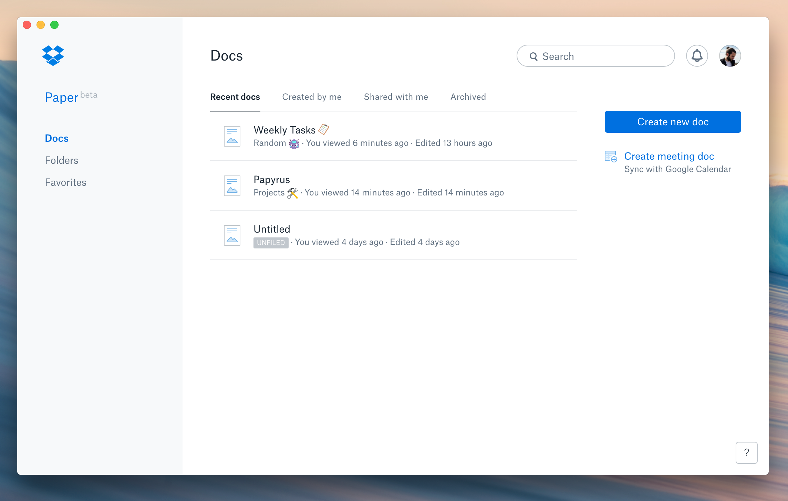

# Papyrus 📑
Unofficial Electron-based wrapper for Dropbox Paper as desktop application.

## Installation
[Download](https://github.com/morkro/papyrus/releases/latest), unzip, and install the application to any location.

#### macOS
It's recommended to move the `Papyrus.app` file to the `Applications` directory.

## Features

### Shortcuts

| Description | Keybinding |
| :--- | :--- |
| Create a new document | <kbd>Cmd/Ctrl</kbd> <kbd>N</kbd> |
| Create a new folder | <kbd>Cmd/Ctrl</kbd> <kbd>T</kbd> |

All keybindings can also be found under the `File` menu.

## Development

The application wraps the official Dropbox Paper website in an [Electron](https://github.com/electron/electron/) browser window _(and does some more minor things to round it up)_.

`git clone` the repository, `npm install` all dependencies and you are good to go. You might have to run `brew install wine` before building the application.

| Command | Description |
| :------ | :---------- |
| `npm start` | Starts the application |
| `npm run build` | Creates packages for all supported platforms _(bundles all below commands)_ |
| `npm run build:macos` | Builds the macOS application |
| `npm run build:windows` | Builds the Windows application |
| `npm run build:linux` | Builds the Linux application |

### Contribution

Any form of contribution is very welcome!

### License

The code is available under [MIT License](LICENSE).
